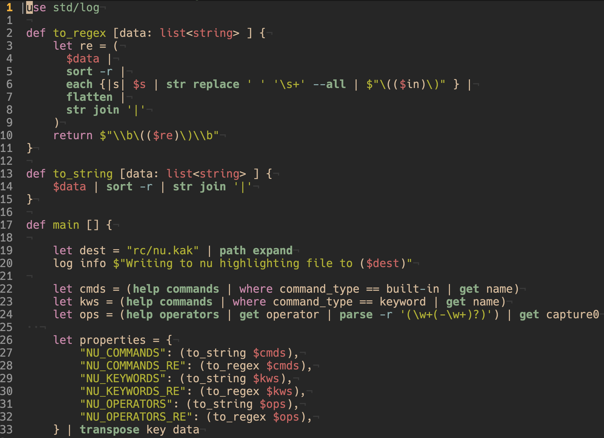

# nu.kak

Syntax highlighting for [nu](https://www.nushell.sh/) files in the [Kakoune](https://github.com/mawww/kakoune) editor.



This is my first kakoune highlighter, and was very much an learning experiment, cobbled together from exploring existing [filetype rc](https://github.com/mawww/kakoune/tree/master/rc/filetype) files, [blog posts](https://zork.net/~st/jottings/Intro_to_Kakoune_highlighters.html), and of course with a bit of assitance from AI (explain this regex please!). As such, any suggestions for improvement are very welcome.

## Installation

With [kak-bundle](https://github.com/jdugan6240/kak-bundle):

```
bundle nu.kak https://github.com/deeuu/nu.kak
```

Or source `./rc/nu.kak` in your `kakrc`.
